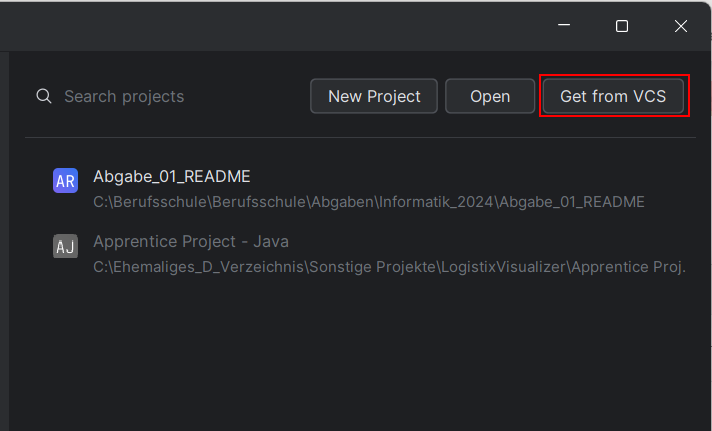
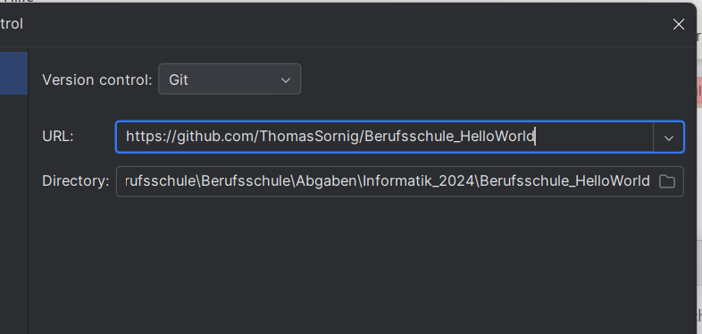
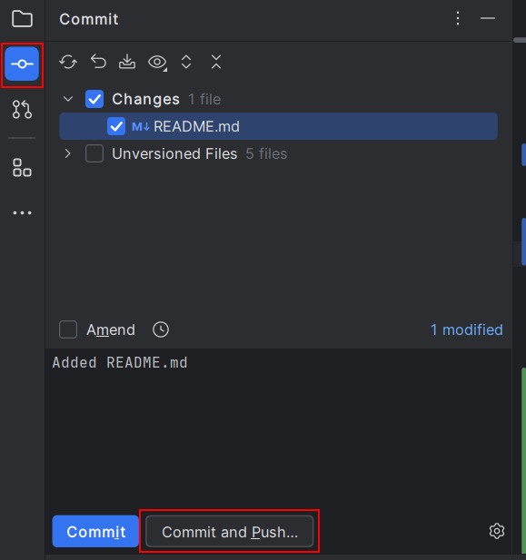

# Berufsschule_HelloWorld
___
Author: Thomas Sornig <br>
LBS Eibiswald 2aAPC <br>
Erstellt am 09.09.2024
___
## Zweck dieses Repositories

Dieses Beispielprojekt dient der Übung verschiedener Themen
- Verwendung von Github
- Clonen eines Repositories
- Commiten der Änderungen
- Verwendung von Markdown
___
## Klonen des Repositories
### Über die Commandline
``` cmd
git clone https://github.com/LBS-Eibiswald-APC/HelloWorld
```
### Oder direkt in IntelliJ


___
## Änderungen auf Github hochladen
### Über die Commandline
``` cmd
git commit
git push
```
### Oder direkt in IntelliJ

___
## Quellen
[Markdown Cheat Sheet](https://s2.studylib.es/store/data/008825178_1-f39e56009941736933e722fe371a5cd3.png) <br>
[Vorlage](https://github.com/LBS-Eibiswald-APC/HelloWorld)